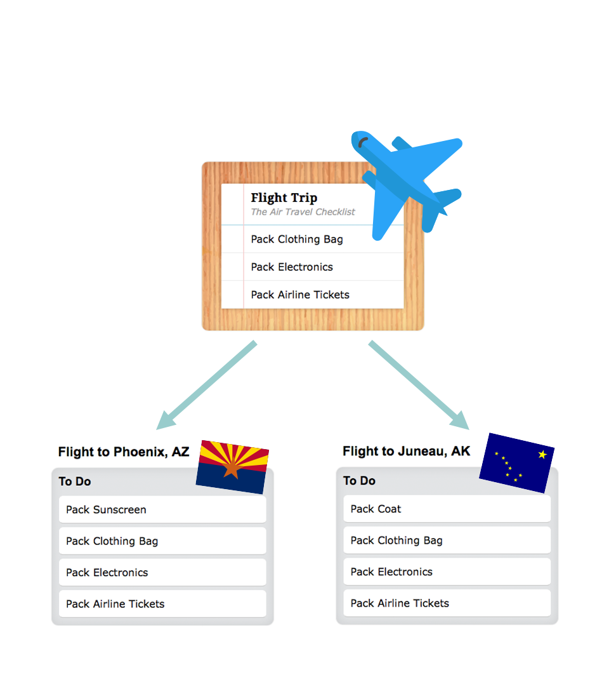
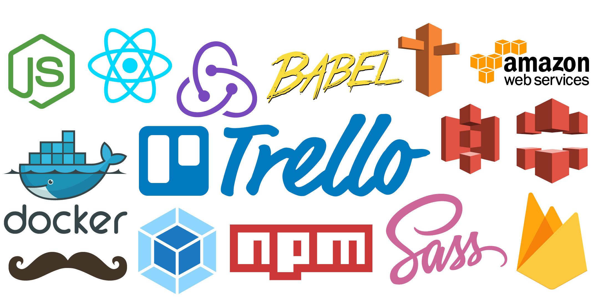

# TempLists
#### to-do list templates for every occasion


### About TempLists
We write, discard and rewrite to-do lists for the recurring events in life (air travel, road trips, hosting houseguests, etc). Even with so much list-making experience, our to-do lists never ever get any better. We're tossing our to-do lists aside instead of refining and reusing them - which leads to forgotten tasks and ineffective lists.

With TempLists, simply select a to-do list template you need. Then, you can edit it to make it your own.



Your lists are sure to get better each time, and so will all your adventures.

### The Best Part
Export your lists to Trello in one click!

### Favorites

You can favorite any of the templates by clicking the heart icon - these templates will be stored in your Favorites section. _(If you travel frequently, go ahead and heart those travel templates!)_

### My Templates
You can modify the templates (edit or delete tasks) to make the list your own - and then you can save your version for future use (which can be found under 'My Templates').

### Collections
With TempLists, users can combine their lists to make collections, and export those into the task management tools they love most _(so go ahead and send your house sitter a collection which includes lists like 'House Maintenance', 'Pet Care', and 'Plant Care'.)_

### Technologies Used

- Node.js
- SASS
- ReactJS
- Redux
- Firebase (backend authentication and data storage)
- Docker
- Webpack
- Babel
- AWS
- Trello API

### Future Features
- Collection Exports
- Export to Notes, Mail and Messages
- Tags / Grouping of Subtasks
- User Template Creation

### Contact Me

- [Crystal Tate](http://crystal.github.io/portfolio)
- [Email](mailto:crys.tate@icloud.com)
- [twitter](http://twitter.com/crystal_tate)


# Get started

### Prerequisites

- Docker 17.x

### Build Docker Image

```
docker build -t templist .
```

### Run Docker Container

```
docker run -v $(pwd):/app -p 3000:3000 --name templist -i -t templist bash
cd /app
npm install # if necessary
npm start
```

## Build Project

### Build for Development (./tmp)

```
# inside docker container
npm run build
```

### Build for Production (./docs)

```
# inside docker container
npm run build-production
```
